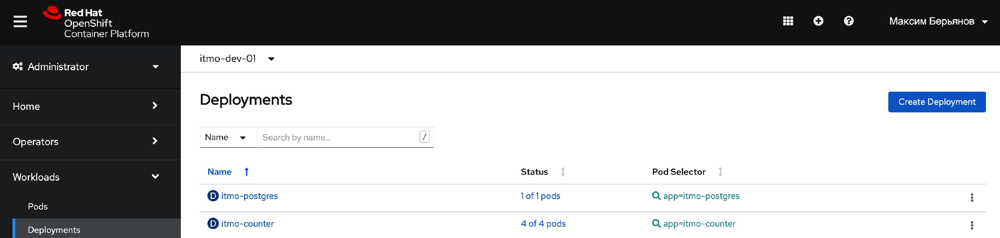

## Задание 5 / 7 / 8 / 9. ПИС.

#### Серверное приложение на платформе node.js

Ниже представлены endpoint'ы по заданию:
```js
app.get("/", (_, res: Response) => {
  res.end(JSON.stringify(counter));
});

app.get("/stat", (_, res: Response) => {
  res.end(JSON.stringify(counter++));
});

app.get("/about", (_, res: Response) => {
  const name = "Maxim Beryanov";
  const html = `<h3>Hello, ${name}!</h3>`;

  res.writeHead(200, {'Content-Type': 'text/html'});
  res.end(html);
});
```

Так как проект на TypeScript, нужно сначала скомпилировать .ts файл. Данный функционал заложен в скриптах файла package.json. Таким образом, при построении Docker-контейнера нужно использовать именно их:
```dockerfile
# используем базовым образ, где нужные инструменты уже установлены (npm, node)
FROM node:latest

# определяем рабочую директорию для приложения
WORKDIR /app

# копируем нужные для сборки и запуска проекта файлы в рабочую директорию 
COPY ["index.ts",  "package.json", "tsconfig.json", ".env", "./"]

# скачиваем нужные библиотеки в соответствии с package.json
RUN npm install

# собираем проект (компилируем .ts файл)
RUN npm run build

# запускаем проект (.js файл)
CMD npm run start

# открываем нужный порт
EXPOSE 8080
```

Собираем образ:
```text
docker build -t msberyanov/itmo-docker-task-5:1.0.0 .
```

Помещаем образ в репозиторий Docker Hub:
```text
docker push msberyanov/itmo-docker-task-5:1.0.0
```

Теперь данный образ можно использовать:
```text
docker pull msberyanov/itmo-docker-task-5:1.0.0
```

И запустить контейнер:
```text
docker run msberyanov/itmo-docker-task-5:1.0.0
```

#### Добавлено в недавней лабораторной (docker-compose)

C помощью docker-compose запускаем два контейнера (первый с базой, второй – с приложением-счетчиком:
```text
docker-compose up
```
Кратко, внутрь прокидываются переменные окружения из файла .env, счетчик цепляется к базе и производит запросы через pg-promise. База PostgreSQL.

#### Добавлено в недавней лабораторной (ci / cd)

Добавлены GitHub Actions скрипты для автоматической сборки и развертывания приложения. 
Разворачивание происходит на физический сервер. 

#### Добавлено в недавней лабораторной (кластеризация)

Предлагается использовать OpenShift-манифесты - для deployment'ов и service'ов.
Допустим имеем развернутый OpenShift / Kubernetes, либо локально запущенный (minikube).
Команды для обработки шаблона deployment, применения сервисов для каждого приложения:

```text
oc process -f openshift/itmo-counter/deployment-template.yml -p IMAGE_TAG=latest | oc apply -f -
oc apply -f openshift/itmo-counter/service.yml

oc process -f openshift/itmo-postgres/deployment-template.yml -p IMAGE_TAG=latest | oc apply -f -
oc apply -f openshift/itmo-postgres/service.yml
```

Таким образом, для деплоймента счетчика указываются 4 реплики - будут созданы 4 подов, смотрящие на базу (которая создается другим деплойментом). 
Общение между ними происходит через сервисы. При желании, для доступа извне можно организовать route.

#### Скриншоты развернутого приложения на OpenShift:


